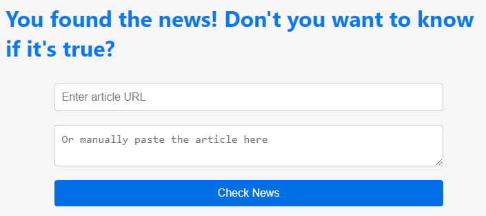
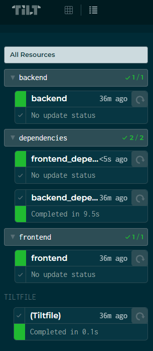
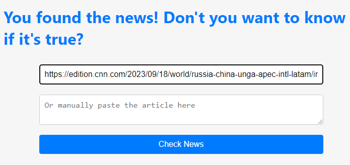
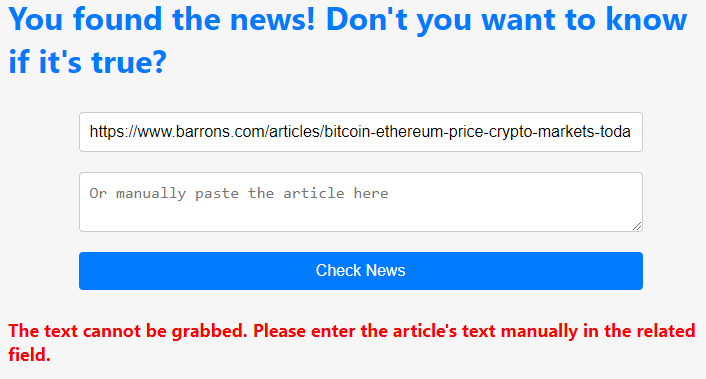
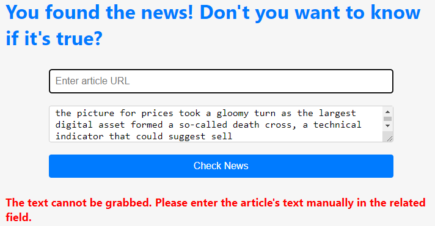

# Fake News Checker

This application is a fake news checker. By inserting the link or a text in the related field, the application can verify if the article is legit or not (fake news).



## Prerequisites

Here are the tools you'll need to install before you get started:

- **Python 3:** The version that the application was tested with was the 3.11.5 version. Download it from the [official Python site](https://www.python.org/downloads/release/python-3115/)
- **Node.js 18:** The version that the application was tested with was the 18.17.1 version. Download it from the [official NodeJs site](https://nodejs.org/en/blog/release/v18.17.1)
- **Tilt:** Follow the instructions on the [official Tilt site](https://docs.tilt.dev/install.html) or use one of the below commands (depending on your OS):
  ```bash
  #For Linux: 
  curl -fsSL https://raw.githubusercontent.com/tilt-dev/tilt/master/scripts/install.sh | bash
  #For Windows (with Powershell): 
  iex ((new-object net.webclient).DownloadString('https://raw.githubusercontent.com/tilt-dev/tilt/master/scripts/install.ps1'))
  #For MacOS: 
  curl -fsSL https://raw.githubusercontent.com/tilt-dev/tilt/master/scripts/install.sh | bash

## Getting Started

To start the website, run the following command in the root directory of the project (where the Tiltfile also resides):

`tilt up`

You can view all the resources (frontend and backend) being deployed at the
URL: [localhost:10350/r/(all)/overview](http://localhost:10350/r/(all)/overview). Here, you can click each resource to
see individual logs and status for each command and step. If one resource (or command) crashes for any reason, you can
restart it by clicking the 'Update' button next to the resource.

Initially, it will download the backend
dependencies ([backend dependencies overview](http://localhost:10350/r/backend_dependencies/overview)). Depending on
your internet connection, this may take some time. After that, it will continue with the frontend
dependencies ([frontend dependencies overview](http://localhost:10350/r/frontend_dependencies/overview)).

**Important Note:** If in the backend dependencies you are getting the error "WARNING: The script `<python package>` is
installed
in `<Python scripts location>` which is not on PATH," add the `<Python scripts location>` to your system's PATH
environment variable.

Once all tilt resources are green:



you can access the application by going to the URL:
[localhost:3000](http://localhost:3000/)

## Check an article
To check an article if it's legit or not (fake news), paste the URL in the related field:


If you got an error that the text could not be grabbed, copy the article's text manually, enter it to the related field and check it again.



